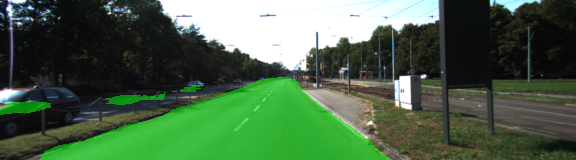
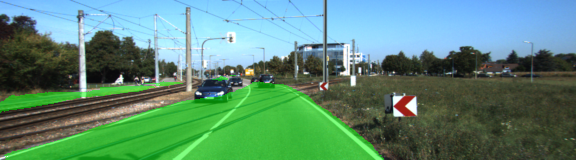
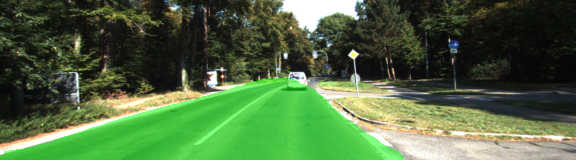
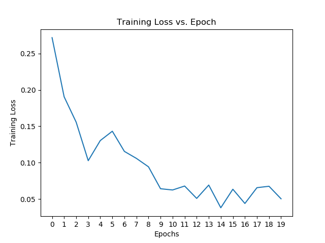

# Reflection

### Implementation
Functions in `main.py` were all completed, with a pretrained vgg-16 model. 

`layer3_out` and `layer4_out` are  scaled by `0.0001` and `0.01`  before fed to the 1x1 convolution (`main.py`, line 90 and 112). The scaling significantly helped the convergence of the optimization. 

In addition, to better understand the shapes of each layer, I added a `print_tensor_sizes()` function (`main.py`, line 208), which is handy to keep track of the shapes of tensors especially when transposed convolutions are used.

### Training
Adam optimizer is used. Other parameters are:

  - keep_prob: `0.5`
  - learning_rate: `0.0009`
  - epochs: `20`
  - batch_size: `5`

### Results
Below are some output images after 20 epochs of training with batch size of 5. The output images clearly show the pixel level segmentation of roads from the background.

Training loss vs. epoch plot is shown below.
